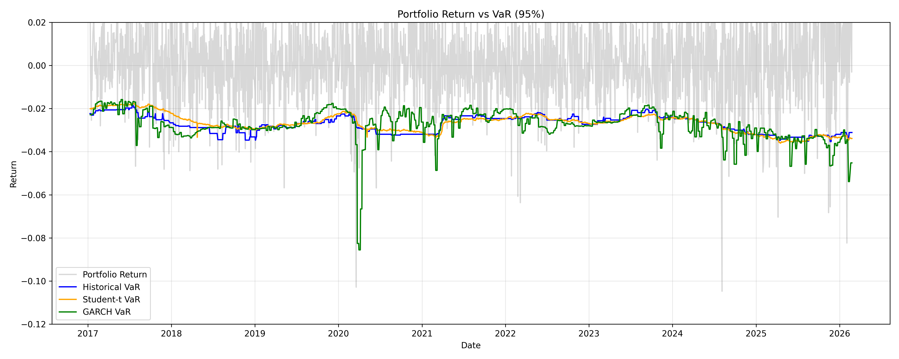
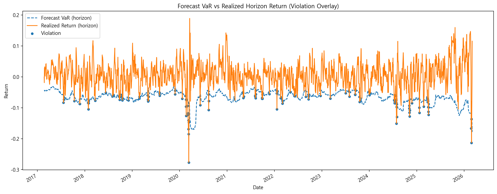
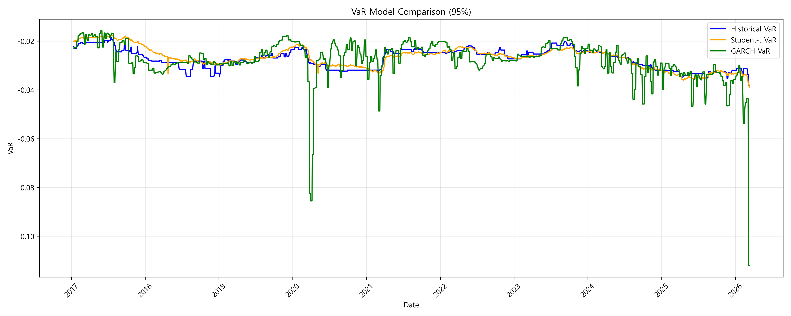
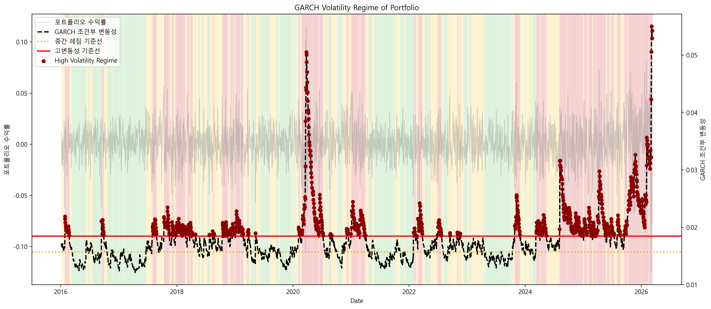
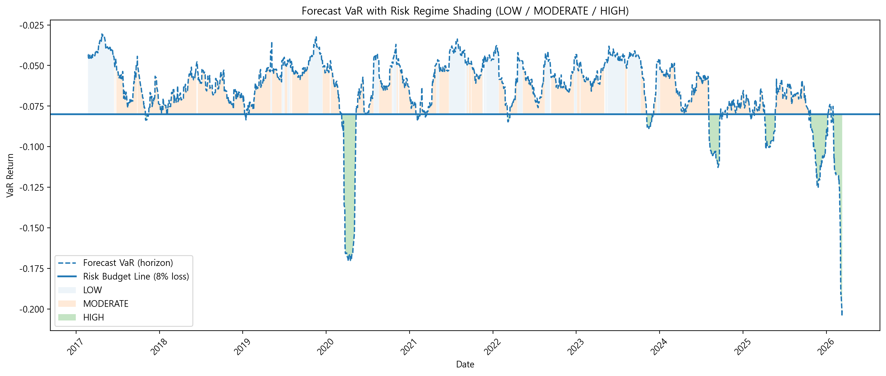

# 📊 한국 반도체 포트폴리오 시장 리스크 분석
## Value-at-Risk 기반 반도체 포트폴리오 리스크 정량 분석

본 프로젝트는 한국 반도체 기업 포트폴리오의 시장 리스크(Market Risk) 를 정량적으로 분석하기 위한 금융 데이터 분석 프로젝트입니다.

본 연구에서는 다음과 같은 리스크 분석 프레임워크를 구축하였습니다.

    - Value-at-Risk (VaR)

    - Conditional Value-at-Risk (CVaR)

    - GARCH Volatility Modeling

    - Volatility Regime Detection

    - VaR Backtesting (Kupiec Test)

    - Stress Testing

이를 통해 시장 변동성 변화에 따른 포트폴리오 리스크 구조(Dynamic Risk Structure) 를 분석하고 데이터 기반 리스크 인사이트를 도출하는 것을 목표로 합니다.


## 📂 Dataset
### 분석 대상 기업
한국 반도체 산업 대표 기업

    - Samsung Electronics
    - SK Hynix
    - Samsung SDI

### Data Source
    Yahoo Finance

### Data Period
    2016 – 2026


## 🔄 Risk Model Architecture

본 프로젝트의 리스크 분석 구조는 다음과 같습니다.

    Data Download (Yahoo Finance)
            ↓
    Data Quality Check
            ↓
    Data Preprocessing
            ↓
    Log Return Calculation
            ↓
    Portfolio Construction
            ↓
    Risk Modeling Framework
            ↓
    Volatility Modeling (GARCH)
            ↓
    Volatility Regime Detection
            ↓
    VaR / CVaR Calculation
            ↓
    Rolling VaR Estimation
            ↓
    Backtesting (Kupiec Test)
            ↓
    Stress Testing
            ↓
    Visualization
            ↓
    Risk Insight Extraction    

## 🧠 Methodology

본 프로젝트에서는 여러 VaR 기반 리스크 모델을 비교 분석합니다.


### 1️⃣ Historical VaR

Historical VaR는 과거 수익률 분포를 기반으로 포트폴리오의 잠재적 손실을 추정하는 방법입니다.

**VaR Formula**

<p align="center">

</p>

여기서

- `R_t` : 포트폴리오 수익률  
- `Q_α` : 수익률 분포의 하위 분위수

특징
    - 구현이 비교적 간단
    - 과거 데이터 기반 분석
    - 시장 충격에 대한 반응 속도가 상대적으로 느림

---

### 2️⃣ Student-t VaR

Student-t 분포를 활용하여 금융 데이터의 **Fat Tail** 특성을 반영한 VaR 모델입니다.

<p align="center">

</p>

특징
    - 금금융 수익률의 두꺼운 꼬리 분포(Fat Tail) 반영
    - 극단적 손실 가능성을 보다 보수적으로 추정
    - Tail Risk 분석에 유리

---

### 3️⃣ GARCH VaR

GARCH 모델은 시간에 따라 변하는 변동성(Time-varying volatility)을 모델링합니다.

**GARCH Volatility Equation**

<p align="center">

</p>

**VaR Calculation**

<p align="center">

</p>

특징
    - 시장 변동성의 시간 변화 반영
    - volatility clustering 모델링 가능
    - 시장 충격 발생 시 VaR 값이 빠르게 확대

## 💻 Model Implementation

다음 코드는 GARCH 모델을 이용한 변동성 추정 예시입니다.

```python
from arch import arch_model

model = arch_model(
    portfolio_returns,
    mean="Zero",
    vol="GARCH",
    p=1,
    q=1,
    dist="t"
)

result = model.fit()

volatility = result.conditional_volatility
```

## 📊 Visualization

### Portfolio Return vs VaR

포트폴리오 **수익률(Portfolio Return)** 과 다양한 **VaR 모델(Historical, Student-t, GARCH)** 을 비교하여 **시장 리스크 변화(Market Risk Dynamics)** 를 분석합니다.



대부분의 기간에서 **포트폴리오 수익률** 은 **VaR 범위(Value-at-Risk Threshold)** 내에서 움직이며, 이는 **VaR 모델이 일반적인 시장 변동성(Market Volatility)** 을 비교적 잘 설명하고 있음을 보여줍니다.

그러나 일부 구간에서는 실제 손실이 **VaR 추정치를 크게 초과하는 Extreme Loss(Tail Risk Event)** 가 관찰됩니다.
이러한 현상은 금융 시장에서 나타나는 **Fat Tail 특성** 과 **Tail Risk** 를 반영합니다.

또한 **GARCH 기반 VaR 모델** 은 **변동성 변화(Volatility Clustering)** 에 더 민감하게 반응하여 시장 충격 이후 **VaR 수준이 빠르게 확대되는 특징** 을 보입니다.

### Forecast VaR vs Realized Return

Forecast **Value-at-Risk(VaR)** 와 실제 **horizon 수익률(Realized Return)** 을 비교하여 VaR 모델의 **예측 성능** 을 평가합니다.



대부분의 기간에서 실제 **포트폴리오 수익률** 은 **Forecast VaR 범위 위에 위치** 하지만, 일부 구간에서는 실제 손실이 **VaR 추정치를 크게 초과하는 Violation** 이 관찰됩니다.

특히 **2020년 시장 충격 구간** 과 최근 일부 **고변동성 구간** 에서는 **violation이 집중적으로 나타나며** , 이는 시장 스트레스 상황에서 **tail risk가 확대될 수 있음을 보여줍니다.**

또한 **Violation이 무작위로 분산되기보다 특정 시기에 군집적으로 발생** 한다는 점은 금융 시장의 **Volatility Clustering 특성**과 일치합니다.

따라서 이 그래프는 **VaR 모델이 일반적인 시장 위험은 설명할 수 있지만, 극단적인 충격 구간에서는 실제 손실을 과소평가할 가능성이 있음 ** 을 보여줍니다.


### VaR Model Comparison

다양한 **VaR 모델(Historical, Student-t, GARCH)의 리스크 추정 결과** 를 비교합니다.



대부분의 기간에서 **Historical VaR** 와 **Student-t VaR** 는 비교적 안정적인 값을 보이며 **유사한 추정 결과** 를 나타냅니다.  
반면 **GARCH VaR** 는 **시장 변동성이 확대되는 구간** 에서 더 크게 하락하며 **리스크 수준이 빠르게 증가** 하는 특징을 보입니다.  

이는 **GARCH 모델**이 **시간에 따라 변화하는 변동성(Time-varying Volatility)** 을 반영하기 때문에 **시장 충격 상황(Market Shock)** 에서 보다 민감하게 **리스크를 추정** 할 수 있음을 보여줍니다.

### GARCH Volatility Regime

포트폴리오의 **조건부 변동성(Conditional Volatility)** 을 **GARCH 모델** 로 추정하고 **시장 변동성을 Regime별**로 구분합니다.



분석 결과 시장 변동성은 일정하지 않고 **Low / Moderate / High Regime** 사이를 **순환하는 특징** 을 보입니다.  
특히 **2020년 시장 충격 구간**과 최근 일부 기간에서는 **High Volatility Regime**이 집중적으로 나타났습니다.  

이는 금융 시장에서 변동성이 특정 시기에 군집적으로 나타나는 **Volatility Clustering** 현상을 보여주며, **시장 스트레스 상황(Market Stress)** 에서 **포트폴리오 리스크** 가 크게 확대될 수 있음을 의미합니다.

### Forecast VaR with Risk Regime

포트폴리오의 **Forecast VaR 변화** 를 **시장 변동성 Regime** 과 함께 시각화합니다.



이 그래프는 시간에 따라 변화하는 **Forecast VaR** 를 보여주며, **시장 변동성 상태를 Low / Moderate / High Regime** 으로 구분하여 표시합니다.

대부분의 기간에서 **VaR** 는 **위험 허용 기준선(Risk Budget Line)** 위에 위치하지만, 일부 시장 충격 구간에서는 **VaR가 크게 하락** 하며 **포트폴리오의 잠재적 손실 위험(Potential Loss Risk)** 이 확대됩니다.

특히 **High Volatility Regime** 에서는 **VaR가 급격히 증가** 하는 경향을 보이며, 이는 **시장 스트레스 상황** 에서 **포트폴리오 리스크** 가 빠르게 확대될 수 있음을 시사합니다.

따라서 이 그래프는 **미래 포트폴리오 리스크**가 현재 **어떤 위험 구간(Risk Regime)**에 위치하는지를 **직관적으로 파악** 하는 데 활용될 수 있습니다.


## 📉 VaR Backtesting (Kupiec Test)

VaR 모델의 적합성을 평가하기 위해 Kupiec POF Test를 수행하였습니다.   

| Model          | Confidence Level | Violation Rate | Result |
| -------------- | ---------------- | -------------- | ------ |
| Historical VaR | 95%              | ~5.78%         | PASS   |
| Historical VaR | 99%              | ~1.48%         | FAIL   |
| Student-t VaR  | 95%              | ~5.4%          | PASS   |
| GARCH VaR      | 95%              | ~4.7%          | PASS   |

분석 결과 Student-t VaR와 GARCH VaR가 Historical VaR보다 안정적인 성능을 보였습니다..


## 🔍 VaR Violation Clustering Analysis

VaR Backtesting 결과 VaR violation이 특정 시기에 집중적으로 발생하는 현상을 확인할 수 있습니다.

이를 Volatility Clustering이라고 합니다.

특히 다음 구간에서 violation이 집중적으로 발생했습니다.

    - 2020 COVID Market Shock
    - High Volatility Regime

이 결과는 금융 시장에서 변동성이 시간에 따라 군집적으로 나타난다는 특징과 일치합니다.

## 💡 Key Insights

분석 결과 다음과 같은 특징을 확인할 수 있었습니다.

### 1️⃣ Volatility Clustering

금융 시장에서는 변동성이 군집적으로 나타나는 현상(volatility clustering)이 관찰되었습니다.

특히 2020년 COVID 시장 충격 구간에서 VaR violation이 집중적으로 발생하며 금융 시장의 volatility clustering 특성이 확인되었습니다.

### 2️⃣ Historical VaR 특징

Historical VaR는 과거 수익률 분포를 기반으로 하기 때문에 급격한 시장 변동성 확대 구간에서는 리스크 변화를 빠르게 반영하지 못하는 경향을 보였습니다.

### 3️⃣ Student-t VaR 특징

Student-t VaR는 금융 수익률의 Fat Tail 특성을 반영하여 Historical VaR보다 극단적 손실 가능성을 보다 보수적으로 추정하는 경향을 보였습니다.

### 4️⃣ GARCH VaR 특징

GARCH VaR는 조건부 변동성을 반영하기 때문에 시장 변동성이 확대되는 구간에서 VaR 값이 빠르게 확대되는 특징을 보였습니다.

### 5️⃣ Volatility Regime 

GARCH Volatility Regime 분석 결과 시장 변동성은 일정하지 않고
Low / Moderate / High Regime 사이를 순환하는 특징을 보였습니다.

특히 시장 충격 구간에서는 High Volatility Regime이 집중적으로 나타나며
포트폴리오 하방 리스크가 크게 확대되는 경향이 확인되었습니다.

### 6️⃣ Dynamic Risk Management Implication

분석 결과 포트폴리오 리스크는 고정된 값이 아니라 시장 변동성 상태에 따라 지속적으로 변화하는 특성을 보였습니다.

따라서 정적인 리스크 관리 방식보다 시장 변동성 Regime에 따라 포트폴리오 노출도를 조절하는
동적 리스크 관리(dynamic risk management)가 필요합니다.


## 🛠 Tech Stack

사용 기술
    - Python
    - Pandas
    - NumPy
    - Matplotlib
    - SciPy
    - ARCH (GARCH Model)
    
## 📁 Project Structure
```semiconductor-portfolio-risk
│
├─ data
│   ├─ raw
│   │
│   └─ processed
│
├─ results
│   ├─ tables
│   │
│   └─ figures
│
├─ src
│   │
│   ├─ __init__.py
│   │
│   ├─ config.py
│   │
│   ├─ data_download.py
│   │      → Yahoo Finance에서 금융 데이터 다운로드
│   │
│   ├─ data_quality.py
│   │      → 데이터 결측치 및 품질 검증
│   │
│   ├─ preprocess.py
│   │      → 데이터 전처리 및 로그 수익률 계산
│   │
│   ├─ portfolio.py
│   │      → 포트폴리오 수익률 계산
│   │
│   ├─ risk_framework.py
│   │      → GARCH 변동성 모델 및 Volatility Regime 분석
│   │
│   ├─ risk_metrics.py
│   │      → VaR / CVaR 계산 및 Backtesting
│   │
│   ├─ visualization.py
│   │      → 리스크 분석 결과 시각화
│   │
│   └─ run_analysis.py
│          → 전체 리스크 분석 파이프라인 실행
│
└─ README.md
```

## 🚀 Future Improvements

향후 다음과 같은 분석 확장을 고려할 수 있습니다.

    - Monte Carlo VaR

    - EVT (Extreme Value Theory)

    - Multi-factor Risk Model

    - Portfolio Optimization

## 🚀 Future Work

향후 다음과 같은 분석 확장이 가능합니다.
    - Monte Carlo VaR
    - Extreme Value Theory
    - Multi-factor Risk Model
    - Portfolio Optimization

## ⭐ Portfolio Note

본 프로젝트는 금융 데이터 분석 및 리스크 모델링 역량 강화를 위한 개인 프로젝트입니다.

본 프로젝트를 통해 다음 역량을 보여주고자 하였습니다.

    - 금융 데이터 분석 파이프라인 구축
    - VaR 기반 리스크 모델 구현
    - 데이터 기반 리스크 인사이트 도출
    - 시장 변동성 기반 리스크 구조 분석

 


